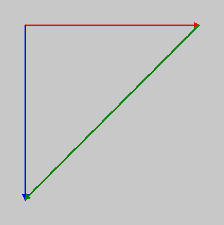

##### Interpolamos?

Vas a tomar como inspiración este ejemplo de la referencia de p5.js:

``` js
function setup() {
    createCanvas(100, 100);
}

function draw() {
    background(200);

    let v0 = createVector(50, 50);
    let v1 = createVector(30, 0);
    let v2 = createVector(0, 30);
    let v3 = p5.Vector.lerp(v1, v2, 0.5);
    drawArrow(v0, v1, 'red');
    drawArrow(v0, v2, 'blue');
    drawArrow(v0, v3, 'purple');
}

function drawArrow(base, vec, myColor) {
    push();
    stroke(myColor);
    strokeWeight(3);
    fill(myColor);
    translate(base.x, base.y);
    line(0, 0, vec.x, vec.y);
    rotate(vec.heading());
    let arrowSize = 7;
    translate(vec.mag() - arrowSize, 0);
    triangle(0, arrowSize / 2, 0, -arrowSize / 2, arrowSize, 0);
    pop();
}
```

Vas a modificarlo para generar este resultado:



- Analiza cómo funciona el método lerp(). 
- Nota que además de la interpolación lineal de vectores, también puedes hacer interpolación lineal de colores con el método lerpColor().

Dedica un tiempo a estudiar cómo se dibuja una flecha en el método drawArrow().

:::caution[📤 Bitácora]
En tu bitácora escribe:

- El código que genera el resultado que te pedí.
- ¿Cómo funciona lerp() y lerpColor().
- ¿Cómo se dibuja una flecha usando drawArrow()?
:::