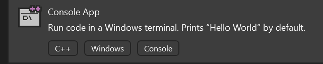
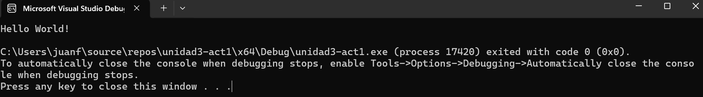
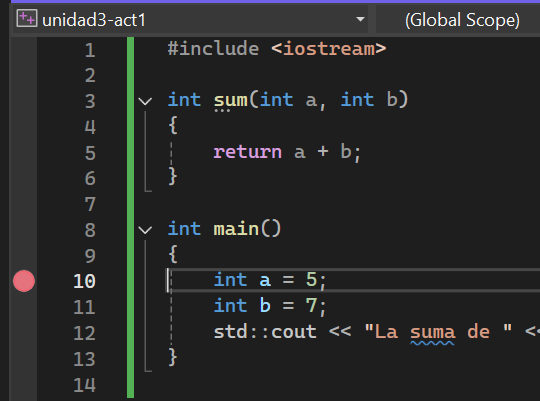
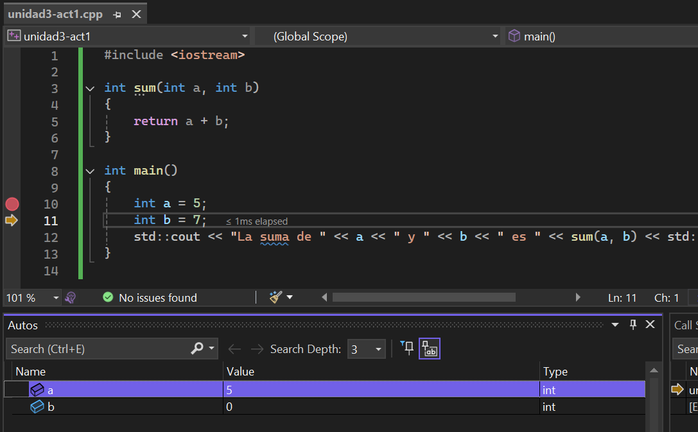

#### Hola mundo

**Enunciado**: vas a familiarizarte con el entorno de desarrollo y comenzarás 
a explorar algunos conceptos básicos de programación en C++.

- Abre Visual Studio (no lo confundas con Visual Studio Code).
- Crea un nuevo proyecto de consola en C++. ¿Cómo se hace esto? 
simplemente selecciona la opción crear un nuevo proyecto. Selecciona el lenguaje C++ y la plataforma 
Windows. Luego selecciona la plantilla de aplicación de consola de Windows.



Una vez crees el proyecto abre el archivo .cpp que contiene la función main. 
(En el menú View selecciona Solution Explorer y luego haz doble clic en el archivo .cpp).

Deberías ver algo así:

```cpp

#include <iostream>

int main()
{
    std::cout << "Hello World!\n";
}
```

Ejecuta el código presionando F5. Deberías ver algo así:



Ahora, modifica el código para que imprima el resultado de la suma de dos números enteros. 
Dicha suma la realizará una función que se llamará `sum`. La función `sum` recibirá dos
parámetros enteros y devolverá la suma de los dos números. 

```cpp
#include <iostream>

int sum(int a, int b)
{
    return a + b;
}

int main()
{
    int a = 5;
    int b = 7;
    std::cout << "La suma de " << a << " y " << b << " es " << sum(a, b) << "\n";
}
```

Ejecuta el código y verifica que el resultado sea correcto.

Por último te pediré que ejecutes paso a paso el código. Para hacer esto, coloca 
un breakpoint en la línea que contiene la definición de la variable `a`, así:



Presiona F5 y luego F10 para ejecutar paso a paso el código. Observa cómo 
cambian las variables en la pestaña Autos (podrás ver esta pestaña en la parte inferior, 
la puedes activar en el menú Debug -> Windows -> Autos) así:



En la esquina superior derecha podrás ver las opciones de depuración:


Familiarízate con estas opciones, te serán de mucha utilidad en el futuro.

¿Qué hace cada una de estas opciones?

**Entraga**: captura de pantalla de la ejecución paso a paso del código. Explica 
qué hace cada una de las opciones de depuración y para qué sirve cada una. Ilustra 
tu respuesta con ejemplos.