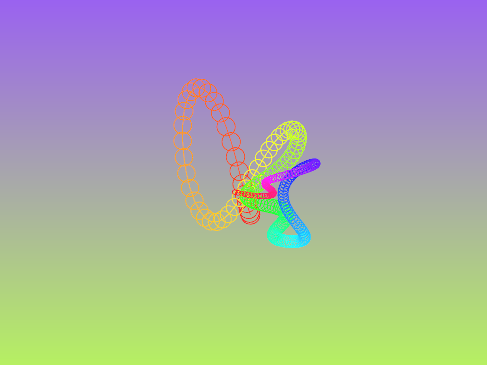

#### Visualizando listas enlazadas con openFrameworks

En esta actividad te voy a mostrar el resultado de lo que lograrás en la unidad.  
Ten presente que en el ejemplo que te enseñaré voy a usar una estructura de datos 
que aún no has visto y que se llama lista enlazada. No te preocupes, en la siguiente 
actividad te mostraré cómo implementarla. Por ahora, la idea es que te familiarices
con openFrameworks.

🎯 **Enunciado**: te mostraré los pasos para instalar y configurar openFrameworks en tu computadora.  
luego analizaremos un ejemplo de programación creativa que utiliza openFrameworks y una lista enlazada, 
pero usando la implementación de la biblioteca estándar de C++. Finalmente, te pediré que analices 
algunas partes del programa y que elabores otras con dibujos.


🛠️ **Instalación**: para instalar openFrameworks en tu computadora, sigue los siguientes pasos:

- Lo primero que debes verificar es que tengas instalado Visual Studio. Ten presente que en las 
computadoras de la Universidad tenemos licencia para la versión profesional. Si quieres 
[instalar Visual Studio](https://visualstudio.microsoft.com/) en tu computadora, vas a tener que instalar 
la versión Community. ESTE PROCESO LO DEBES HACER POR FUERA DE LA SESIÓN DE TRABAJO porque puede tardar 
mucho tiempo. Mi recomendación es que uses las computadoras de la Universidad. 
- En las computadoras de la Universidad ya tienes instalado el compilador de C++; sin embargo, es posible 
que no lo tengas en tu computadora. De nuevo, te recomiendo que uses las computadoras de la Universidad para 
que aproveches el tiempo de la sesión de trabajo. No obstante, si quieres instalar el compilador en tu
computadora, puedes hacerlo siguiendo [este tutorial](https://youtu.be/yIb4icSHfBY?si=R5cR_6E3mf2hc1ok).
- Descarga openFrameworks desde [este enlace](https://openframeworks.cc/download/). En este punto 
seleccionaras Windows y Visual Studio. En una vez descargado el archivo, descomprime en el directorio 
de Documentos de tu computadora. No lo pongas en el escritorio.
- Abre el archivo emptyExample.sln que se encuentra en la carpeta `apps/myApps/emptyExample` de la carpeta
donde descomprimiste openFrameworks.
- Haz clic en el botón de `Local Windows Debugger` para compilar y ejecutar el proyecto. Si todo está bien,
deberías ver una ventana en blanco.

**Resultado esperado**: vas a crear un proyecto en openFrameworks y añadirás el código que te mostraré.

- Ve al directorio projectGenerator que se encuentra en la carpeta de openFrameworks. Ejecuta el archivo 
projectGenerator.exe.
- Nombra el proyecto scUnit4Activity01. Verifica que la ruta de tu proyecto sea `apps/myApps` y que la plataforma 
sea Visual Studio. Haz clic en el botón de `Generate`.
- Si todo sale bien deberías ver un mensaje que dice que el proyecto se generó correctamente. Haz clic en el
botón de `Open in IDE`.
- Al abrir el proyecto por primera vez verás una ventana emergente que te indicará que es necesario actualizar 
el proyecto. Haz clic en el botón de `OK`. Esta acción actualizará la configuración del proyecto para que se 
pueda compilar con la versión de Windows SDK y el compilador de Visual Studio que tienes instalado.
- Haz clic en el botón de `Local Windows Debugger` para compilar y ejecutar el proyecto. Si todo está bien,
deberías ver una ventana en blanco.
- Cierra la ventana emergente que se abrió al principio y abre el archivo `ofApp.cpp` que se encuentra en la
carpeta `src` del proyecto.
- Copia y pega el siguiente código en el archivo `ofApp.cpp`:

``` cpp
#include "ofApp.h"

//--------------------------------------------------------------
void ofApp::setup() {
    backgroundHue = 0;

    // Inicializa la serpiente con varios nodos en el centro
    for (int i = 0; i < 20; i++) {
        snake.emplace_back(ofGetWidth() / 2, ofGetHeight() / 2);
    }
}

//--------------------------------------------------------------
void ofApp::update() {

    glm::vec2 target = glm::vec2(ofGetMouseX(), ofGetMouseY());
    float interpolationFactor = 0.2;  // controla la velocidad de movimiento (0-1)

    for (auto& pos : snake) {
        pos = glm::mix(glm::vec3(pos, 0.0f), glm::vec3(target, 0.0f), 0.2); // Se mueve gradualmente
        target = pos;  // Cada nodo sigue al anterior
    }

    backgroundHue = fmod(backgroundHue + 0.1, 255);
}

//--------------------------------------------------------------
void ofApp::draw() {
    // Fondo dinámico con gradiente
    ofColor color1 = ofColor::fromHsb(backgroundHue, 150, 240);
    ofColor color2 = ofColor::fromHsb(fmod(backgroundHue + 128, 255), 150, 240);
    ofBackgroundGradient(color1, color2, OF_GRADIENT_LINEAR);

    
    // curva suave conectando los nodos
    if (snake.size() > 1) {
        ofMesh mesh;
        mesh.setMode(OF_PRIMITIVE_LINE_STRIP);
        int index = 0;
        for (const auto& pos : snake) {
            float hue = ofMap(index++, 0, snake.size() - 1, 0, 255);
            mesh.addColor(ofColor::fromHsb(hue, 200, 255));
            mesh.addVertex(glm::vec3(pos, 0.0f));
        }
        ofSetLineWidth(2);
        mesh.draw();
    }
    
    // Círculos con tamaño y color variable   
    int index = 0;
    ofNoFill();
    ofSetLineWidth(2);
    for (const auto& pos : snake) {
        float hue = ofMap(index, 0, snake.size() - 1, 0, 255);
        ofSetColor(ofColor::fromHsb(hue, 220, 255));
        float radius = ofMap(index++, 0, snake.size() - 1, 20, 5);
        ofDrawCircle(pos.x, pos.y, radius);
    }
       
}

//--------------------------------------------------------------
void ofApp::keyPressed(int key) {
    if (key == 'c') {
        snake.clear();
    }
    else if (key == 'a') {
        snake.emplace_back(ofRandomWidth(), ofRandomHeight());
	}
	else if (key == 'r') {
        if (!snake.empty()) {
            snake.pop_back();
        }
		
	}
	else if (key == 's') {
		ofSaveFrame();
	}
}
```

- Copia y pega el siguiente código en el archivo `ofApp.h` que se encuentra en la carpeta `src` del proyecto:

``` cpp
#pragma once

#include "ofMain.h"
#include <list>

class ofApp : public ofBaseApp {
public:
    std::list<glm::vec2> snake;
    float backgroundHue;

    void setup();
    void update();
    void draw();
    void keyPressed(int key);
};
```

- Ejecuta el programa y explora su funcionamiento. Prueba las teclas `a`, `r`, `c` y `s` para añadir,
quitar, limpiar y guardar una captura de pantalla, respectivamente.

Una captura de pantalla del resultado esperado es la siguiente:




**Preguntas de reflexión**:

¿Cómo funciona este programa?

No olvides que este programa es compilado, es decir, se convierte en código máquina que la computadora puede entender.
Por tanto, el programa no es más que una modelo de cómo se comportará el código máquina. Según el código, el punto 
de entrada es la función `main` que se encuentra en el archivo `main.cpp`. Esta función crea una instancia de la clase 
`ofApp`:

``` cpp
#include "ofMain.h"
#include "ofApp.h"

//========================================================================
int main( ){

	//Use ofGLFWWindowSettings for more options like multi-monitor fullscreen
	ofGLWindowSettings settings;
	settings.setSize(1024, 768);
	settings.windowMode = OF_WINDOW; //can also be OF_FULLSCREEN

	auto window = ofCreateWindow(settings);

	ofRunApp(window, make_shared<ofApp>());
	ofRunMainLoop();

}
```

¿Recuerdas qué es ofApp? Observa de nuevo el código de ofApp.h. Ahora lo puedes ver?

Notarás que se está creando un objeto de la clase `ofApp` y se está ejecutando el método `ofRunApp` que recibe como 
parámetro el objeto de la clase `ofApp`. Este método se encarga de ejecutar el método `setup` de la clase `ofApp` 
(solo una vez) y luego de ejecutar el método `update` y `draw` en un ciclo infinito, primero `update` y luego `draw`.

Hay mucho que digerir en este código, pero por ahora quiero que te concentres en la lista enlazada que se está 
utilizando para representar la serpiente.

¿Cuándo se crea la lista? 

El objeto que representa la lista se crear al momento de crear la instancia de la ofApp. 

¿Tiene datos la lista en el momento de su creación?

No, la lista está vacía. Sin embargo, en el método `setup` se añaden 20 nodos a la lista. Cada nodo representa una
parte de la serpiente.

¿cómo funciona una lista enlazada?

Una lista enlazada es una estructura de datos que se compone de nodos. Cada nodo tiene un valor y una ``referencia`` al
siguiente nodo. En este caso, cada nodo tiene una posición en el plano y una referencia al siguiente nodo. La serpiente
se mueve siguiendo la posición del nodo anterior. El primer nodo sigue al mouse y los demás nodos siguen al nodo anterior.

📤 **Entrega**: 

1. Vas a suponer que la lista tiene 5 nodos, cada nodo tiene una posición en el plano. Realiza 
un dibujo que represente la lista enlazada. No olvides qué es una lista enlazada. Inserta un nodo, 
elimina un nodo y limpia la lista.

En el código que te mostré: 

2. ¿Cómo se crea la lista enlazada?
3. ¿Cómo se añaden los primero nodos a la lista?
4. ¿Cómo se añaden nodos adicionales a la lista?
5. ¿Cómo se eliminan nodos de la lista?
6. ¿Cómo se limpia la lista?
7. ¿Cómo se verifica si la lista está vacía?
