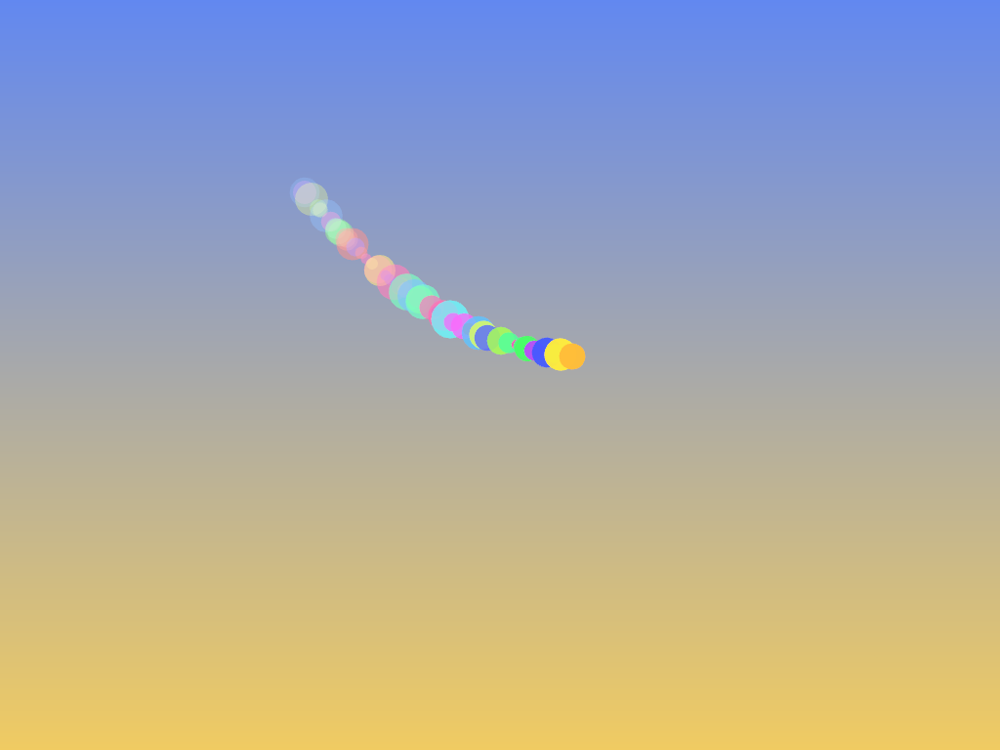
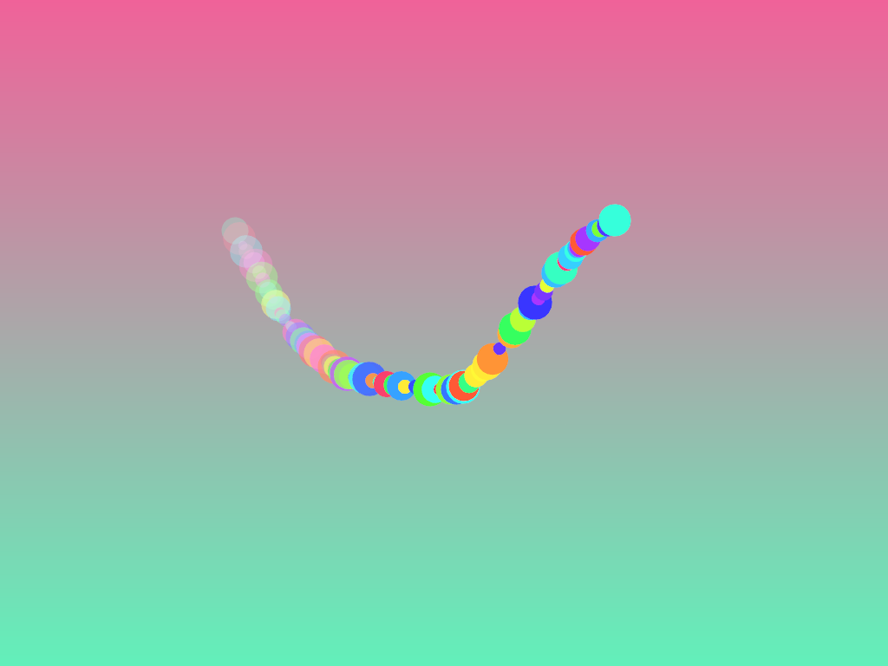

#### Implementación de una cola: "Ecos de Color"

🎯 **Enunciado:**: 

En esta actividad, implementarás una cola (FIFO - First In, First Out) para crear un efecto de 
pintura dinámica en la pantalla. Cada vez que el usuario mueve el mouse, se agregará un `trazo` en la pantalla, pero los trazos más antiguos se desvanecerán y desaparecerán con el tiempo, creando un efecto de eco visual.

**Objetivos de esta actividad**:

- Aplicar el conocimiento adquirido con listas enlazadas en una nueva estructura de datos: una cola (FIFO).
- Desarrollar una estructura de datos desde cero sin depender de std::queue.
- Implementar una solución interactiva en OpenFrameworks que visualiza la estructura en acción.
- Practicar el manejo de punteros, memoria dinámica y recorridos en estructuras enlazadas.

Tu tarea es implementar la estructura de datos BrushQueue y completar el código de ofApp.cpp donde faltan fragmentos clave

**Requisitos del problema**:

1. Implementar una cola (BrushQueue) desde cero sin usar std::queue ni std::list.

2. Cada nodo de la cola debe almacenar:

    - La posición (x, y) del trazo.
    - El radio del trazo.
    - El color del trazo.
    - La opacidad del trazo.

3. Funciones obligatorias en BrushQueue:

    - enqueue(x, y, radius, color, opacity): agregar un nuevo trazo.
    - dequeue(): eliminar el trazo más antiguo cuando se alcance el tamaño máximo.
    - clear(): eliminar todos los trazos.
    - isEmpty(): indicar si la cola está vacía.

4. Comportamiento del programa:

    - Cuando el usuario mueve el mouse, se debe agregar un nuevo trazo con un color aleatorio.
    - Cuando el usuario presiona 'c', se deben borrar todos los trazos de la pantalla.
    - Cuando el usuario presiona 'a', se debe alternar entre una cola de tamaño 50 y 100.

**Código base (con fragmentos faltantes)**:

ofApp.h:

``` cpp
#pragma once
#include "ofMain.h"

// Nodo de la cola
struct Node {
    float x, y;
    float radius;
    ofColor color;
    float opacity;
    Node* next;

    Node(float _x, float _y, float _radius, ofColor _color, float _opacity)
        : x(_x), y(_y), radius(_radius), color(_color), opacity(_opacity), next(nullptr) {
    }
};

// Implementación manual de una cola (FIFO)
class BrushQueue {
public:
    Node* front;
    Node* rear;
    int size;
    int maxSize;

    BrushQueue(int _maxSize);
    ~BrushQueue();
    
    void enqueue(float x, float y, float radius, ofColor color, float opacity);
    void dequeue();
    void clear();
    bool isEmpty();
};


// Constructor
BrushQueue::BrushQueue(int _maxSize) : front(nullptr), rear(nullptr), size(0), maxSize(_maxSize) {}

// Destructor
BrushQueue::~BrushQueue() {
    clear();
}

// Implementa aquí `enqueue()`
void BrushQueue::enqueue(float x, float y, float radius, ofColor color, float opacity) {
    // TODO: crear un nuevo nodo y agregarlo al final de la cola.
    // Si la cola supera `maxSize`, eliminar el nodo más antiguo con `dequeue()`.
}

// Implementa aquí `dequeue()`
void BrushQueue::dequeue() {
    // TODO: eliminar el nodo más antiguo si la cola no está vacía.
}

// Implementa aquí `clear()`
void BrushQueue::clear() {
    // TODO: eliminar todos los nodos de la cola.
}

// Implementa aquí `isEmpty()`
bool BrushQueue::isEmpty() {
    // TODO: retornar si la cola está vacía.
}


class ofApp : public ofBaseApp {
public:
    BrushQueue strokes; // Cola de trazos
    float backgroundHue = 0;

    ofApp() : strokes(50) {} // Tamaño máximo de la cola

    void setup();
    void update();
    void draw();
    void keyPressed(int key);
};

```

ofApp.cpp:

``` cpp	
#include "ofApp.h"

//--------------------------------------------------------------
void ofApp::setup() {
    ofBackground(0);
}

//--------------------------------------------------------------
void ofApp::update() {
    backgroundHue += 0.2;
    if (backgroundHue > 255) backgroundHue = 0;

    // TODO: agregar un nuevo trazo si el mouse está presionado.
    // Usa strokes.enqueue(x, y, radius, color, opacity);
}

//--------------------------------------------------------------
void ofApp::draw() {
    // Fondo con gradiente dinámico
    ofColor color1, color2;
    color1.setHsb(backgroundHue, 150, 240);
    color2.setHsb(fmod(backgroundHue + 128, 255), 150, 240);
    ofBackgroundGradient(color1, color2, OF_GRADIENT_LINEAR);

    // TODO: dibujar los trazos almacenados en la cola.
    // Recorre los nodos desde strokes.front hasta nullptr y usa ofDrawCircle().
}

//--------------------------------------------------------------
void ofApp::keyPressed(int key) {
    if (key == 'c') {
        // TODO: limpiar la cola de trazos.
    }
    if (key == 'a') {
        // TODO: alternar entre 50 y 100 trazos.
    }
    else if (key == 's') {
        // TODO: guardar el frame actual.
    }
}

```

**Resultado esperado**:

maxSize = 50



maxSize = 100



**Tareas para completar la actividad**:

Completa el código de ofApp.h:

- enqueue(): agrega un nodo al final y elimina el más antiguo si supera maxSize.
- dequeue(): elimina el nodo más antiguo.
- clear(): borra toda la cola.
- isEmpty(): retorna si la cola está vacía.

Completa los fragmentos faltantes en ofApp.cpp:

- En update(), llama a enqueue() cada vez que el mouse esté presionado.
- En draw(), recorre la cola y dibuja los nodos con ofDrawCircle().
- En keyPressed(), implementa:
    - 'c' para limpiar la cola (clear()).
    - 'a' para alternar entre 50 y 100 trazos (maxSize).

**Notas**:

- ¿Cómo recorrer la cola en draw()? Usa un while para recorrer los nodos desde front hasta nullptr.
- ¿Cómo evitar memory leaks? Asegúrate de liberar la memoria correctamente en dequeue() y clear().
- ¿Cómo hacer que los trazos desaparezcan gradualmente? Usa ofMap(i, 0, maxSize, 50, 255) para ajustar la opacidad.

📤 **Entrega**:

✅ 1. Código fuente completo

📌 Completa los archivos proporcionados asegurándote de implementar correctamente las siguientes funciones:

🔹 En BrushQueue.cpp:

- enqueue(): agregar un nodo al final de la cola.  
- dequeue(): eliminar el nodo más antiguo cuando la cola supere maxSize.  
- clear(): vaciar completamente la cola.  
- isEmpty(): verificar si la cola está vacía.  

🔹 En ofApp.cpp:

- En update(), agrega trazos con enqueue() cuando el mouse esté presionado.  
- En draw(), recorre la cola para dibujar los trazos en pantalla.  
- En keyPressed(), implementa:

    - 'c': limpia todos los trazos (clear()).  
    - 'a': alterna el tamaño máximo de la cola entre 50 y 100.  

📌 Reglas importantes sobre el código:

- Asegúrate de manejar correctamente la memoria dinámica para evitar fugas.  
- Respeta la lógica FIFO de la cola: el primer elemento que entra debe ser el 
primero en salir cuando se alcanza el límite.  

✅ 2. Capturas de pantalla  
📌 Adjunta una o más capturas de pantalla mostrando el programa en ejecución con:

- La visualización de los trazos generados al mover el mouse.  
- Evidencia de que los trazos más antiguos desaparecen al alcanzar el límite de la cola.  
- Una captura con maxSize = 50 y otra con maxSize = 100.  

✅ 3. Uso del depurador en Visual Studio  
📌 Verifica el correcto funcionamiento de la estructura con el depurador de Visual Studio 
e incluye una breve descripción de cómo realizaste la depuración.

🔹 Herramienta a usar:

Depurador de Visual Studio con puntos de interrupción y visualización de memoria.

🔹 Qué debes hacer:

- Coloca puntos de interrupción en los métodos de BrushQueue (enqueue, dequeue, clear) y observa cómo cambia la estructura en memoria.  
- Inspecciona los valores de los nodos en enqueue() para asegurarte de que se enlazan correctamente.  
- Verifica que dequeue() elimine correctamente el primer nodo cuando se alcanza el límite de la cola.  
- Comprueba que clear() borre toda la memoria sin dejar nodos huérfanos.  

🔹 Ejemplo de lo que debes incluir en tu entrega:

- Qué herramientas usaste en Visual Studio.  
- Capturas de pantalla del depurador mostrando el estado de la cola en diferentes momentos.  
- Explicación de qué verificaste en cada prueba.  

Ejemplo de reporte de depuración:

"Usé el depurador de Visual Studio y coloqué un punto de interrupción en enqueue().
Verifiqué que los nodos se enlazaran correctamente al visualizar front y rear en la ventana de variables locales.
Luego, al alcanzar el límite de 50 elementos, observé que dequeue() eliminaba correctamente el primer nodo."  

✅ 4. Lista de pruebas realizadas  

📌 Detalla las pruebas que realizaste para confirmar que tu código funciona correctamente.

Para cada prueba, indica:

- Qué intentaste probar.  
- Qué resultado esperabas obtener.  
- Qué resultado obtuviste.  
- Si el resultado fue correcto o si tuviste que corregir algo.

Ejemplo de lista de pruebas:

Prueba de inserción:

Llamé a enqueue(100, 100, 10, ofColor::red, 255). Esperaba ver un nodo rojo en pantalla. Se dibujó correctamente. ✅

Prueba de eliminación FIFO:

Inserté 51 trazos y verifiqué que el primero desapareciera. Esperaba que el nodo más antiguo fuera eliminado.
Se eliminó correctamente. ✅

Prueba de vaciado:

Presioné 'c', esperaba que todos los nodos desaparecieran. Los nodos se eliminaron y la pantalla quedó vacía. ✅

Prueba de alternancia de tamaño:

Presioné 'a', la cola cambió de tamaño. Verifiqué que ahora podía almacenar hasta 100 elementos antes de eliminar los antiguos. ✅

📌 Resumen de lo que debes entregar

✅ Código fuente completo (BrushQueue.cpp y ofApp.cpp con la implementación final).  
✅ Capturas de pantalla del programa en ejecución.  
✅ Reporte de depuración en Visual Studio con capturas y explicación de los resultados.  
✅ Lista de pruebas realizadas con los resultados esperados y obtenidos.  

📌 Notas finales

- Enfócate en la implementación de la cola, es el objetivo principal del ejercicio.  
- Asegúrate de que enqueue y dequeue respeten la lógica FIFO.  
- Usa Visual Studio para depurar y verificar que tu código sea correcto y eficiente.  
