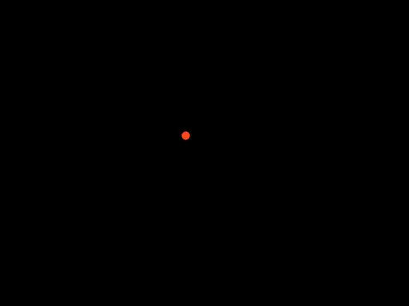
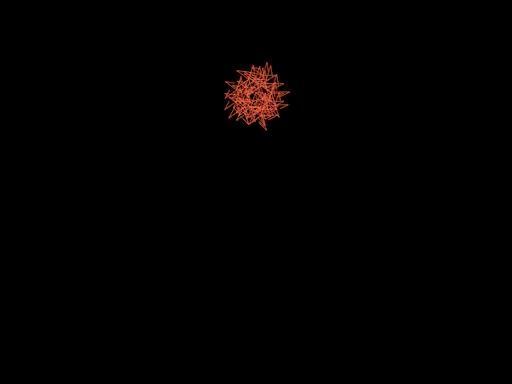
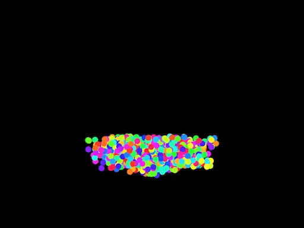
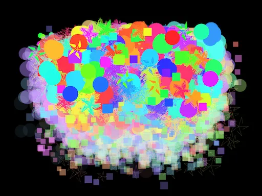

#### Exploraremos los conceptos desde el arte generativo

🎯 **Enunciado**: en esta actividad te mostraré una aplicación para que veas 
aplicados todos los conceptos que estudiarás en esta unidad. 

Durante la actividad te indicaré los momentos en los que debes detenerte para 
analizar 🧐, experimentar 🧪 y reportar ✍️ tus hallazgos en la bitácora de 
aprendizaje.

Crea un proyecto en openFrameworks y adiciona el siguiente código.

ofApp.h

``` cpp
#pragma once
#include "ofMain.h"
#include <vector>

// -------------------------------------------------
// Clase base abstracta: Particle
// -------------------------------------------------
class Particle {
public:
    virtual ~Particle() {}
    virtual void update(float dt) = 0;
    virtual void draw() = 0;
    virtual bool isDead() const = 0;
    // Nuevo método para saber si la partícula (tipo RisingParticle) debe explotar
    virtual bool shouldExplode() const { return false; }
    // Métodos para obtener posición y color, para usarlos en explosiones
    virtual glm::vec2 getPosition() const { return glm::vec2(0, 0); }
    virtual ofColor getColor() const { return ofColor(255); }
};

// -------------------------------------------------
// RisingParticle: Partícula que nace en la parte inferior central y sube
// -------------------------------------------------
class RisingParticle : public Particle {
protected:
    glm::vec2 position;
    glm::vec2 velocity;
    ofColor color;
    float lifetime; // tiempo máximo antes de explotar
    float age;
    bool exploded;
public:
    RisingParticle(const glm::vec2& pos, const glm::vec2& vel, const ofColor& col, float life)
        : position(pos), velocity(vel), color(col), lifetime(life), age(0), exploded(false) {
    }

    void update(float dt) override {
        position += velocity * dt;
        age += dt;
        // Aumenta la desaceleración para dar sensación de recorrido largo
        velocity.y += 9.8f * dt * 8;
        // Condición de explosión: cuando la partícula alcanza aproximadamente el 15% de la altura
        float explosionThreshold = ofGetHeight() * 0.15 + ofRandom(-30, 30);
        if (position.y <= explosionThreshold || age >= lifetime) {
            exploded = true;
        }
    }

    void draw() override {
        ofSetColor(color);
        // Partícula más grande
        ofDrawCircle(position, 10);
    }

    bool isDead() const override { return exploded; }
    bool shouldExplode() const override { return exploded; }
    glm::vec2 getPosition() const override { return position; }
    ofColor getColor() const override { return color; }
};

// -------------------------------------------------
// Clase base para explosiones: ExplosionParticle
// -------------------------------------------------
class ExplosionParticle : public Particle {
protected:
    glm::vec2 position;
    glm::vec2 velocity;
    ofColor color;
    float age;
    float lifetime;
    float size;  // tamaño de la partícula de explosión
public:
    ExplosionParticle(const glm::vec2& pos, const glm::vec2& vel, const ofColor& col, float life, float sz)
        : position(pos), velocity(vel), color(col), age(0), lifetime(life), size(sz) {
    }

    void update(float dt) override {
        position += velocity * dt;
        age += dt;
        float alpha = ofMap(age, 0, lifetime, 255, 0, true);
        color.a = alpha;
    }

    bool isDead() const override { return age >= lifetime; }
};

// -------------------------------------------------
// CircularExplosion: Explosión en patrón circular
// -------------------------------------------------
class CircularExplosion : public ExplosionParticle {
public:
    CircularExplosion(const glm::vec2& pos, const ofColor& col)
        : ExplosionParticle(pos, glm::vec2(0, 0), col, 1.2f, ofRandom(16, 32)) {
        float angle = ofRandom(0, TWO_PI);
        float speed = ofRandom(80, 200);
        velocity = glm::vec2(cos(angle), sin(angle)) * speed;
    }

    void draw() override {
        ofSetColor(color);
        ofDrawCircle(position, size);
    }
};

// -------------------------------------------------
// RandomExplosion: Explosión con direcciones aleatorias
// -------------------------------------------------
class RandomExplosion : public ExplosionParticle {
public:
    RandomExplosion(const glm::vec2& pos, const ofColor& col)
        : ExplosionParticle(pos, glm::vec2(0, 0), col, 1.5f, ofRandom(16, 32)) {
        velocity = glm::vec2(ofRandom(-200, 200), ofRandom(-200, 200));
    }

    void draw() override {
        ofSetColor(color);
        ofDrawRectangle(position.x, position.y, size, size);
    }
};

// -------------------------------------------------
// StarExplosion: Explosión en forma de estrella
// -------------------------------------------------
class StarExplosion : public ExplosionParticle {
public:
    StarExplosion(const glm::vec2& pos, const ofColor& col)
        : ExplosionParticle(pos, glm::vec2(0, 0), col, 1.3f, ofRandom(20, 40)) {
        float angle = ofRandom(0, TWO_PI);
        float speed = ofRandom(90, 180);
        velocity = glm::vec2(cos(angle), sin(angle)) * speed;
    }

    void draw() override {
        ofSetColor(color);
        int rays = 5;
        float outerRadius = size;
        float innerRadius = size * 0.5;
        ofPushMatrix();
        ofTranslate(position);
        for (int i = 0; i < rays; i++) {
            float theta = ofMap(i, 0, rays, 0, TWO_PI);
            float xOuter = cos(theta) * outerRadius;
            float yOuter = sin(theta) * outerRadius;
            float xInner = cos(theta + PI / rays) * innerRadius;
            float yInner = sin(theta + PI / rays) * innerRadius;
            ofDrawLine(0, 0, xOuter, yOuter);
            ofDrawLine(xOuter, yOuter, xInner, yInner);
        }
        ofPopMatrix();
    }
};

// -------------------------------------------------
// ofApp: Manejo de la escena y eventos
// -------------------------------------------------
class ofApp : public ofBaseApp {
public:
    void setup();
    void update();
    void draw();
    void mousePressed(int x, int y, int button);
	void keyPressed(int key);

    std::vector<Particle*> particles;
    ~ofApp();

private:
	void createRisingParticle();

};

``` 

ofApp.cpp

``` cpp
#include "ofApp.h"

// --------------------------------------------------------------
void ofApp::setup() {
    ofSetFrameRate(60);
    ofBackground(0);
}

// --------------------------------------------------------------
void ofApp::update() {
    float dt = ofGetLastFrameTime();

    // Actualiza todas las partículas
    for (int i = 0; i < particles.size(); i++) {
        particles[i]->update(dt);
    }

    // Procesa las partículas (iteración en reversa para facilitar eliminación)
    for (int i = particles.size() - 1; i >= 0; i--) {
        // Si la partícula debe explotar, generamos nuevas explosiones
        if (particles[i]->shouldExplode()) {
            int explosionType = (int)ofRandom(3); // 0: Circular, 1: Random, 2: Star
            int numParticles = (int)ofRandom(20, 30);
            for (int j = 0; j < numParticles; j++) {
                if (explosionType == 0) {
                    particles.push_back(new CircularExplosion(particles[i]->getPosition(), particles[i]->getColor()));
                }
                else if (explosionType == 1) {
                    particles.push_back(new RandomExplosion(particles[i]->getPosition(), particles[i]->getColor()));
                }
                else {
                    particles.push_back(new StarExplosion(particles[i]->getPosition(), particles[i]->getColor()));
                }
            }
            delete particles[i];
            particles.erase(particles.begin() + i);
        }
        else if (particles[i]->isDead()) {
            delete particles[i];
            particles.erase(particles.begin() + i);
        }
    }
}

// --------------------------------------------------------------
void ofApp::draw() {
    for (int i = 0; i < particles.size(); i++) {
        particles[i]->draw();
    }
}

// --------------------------------------------------------------
void ofApp::createRisingParticle() {
	// Genera una RisingParticle cerca del centro inferior (con variación horizontal)
	float minX = ofGetWidth() * 0.35;
	float maxX = ofGetWidth() * 0.65;
	float spawnX = ofRandom(minX, maxX);
	glm::vec2 pos(spawnX, ofGetHeight());
	// La partícula apunta hacia un objetivo en la parte superior central
	glm::vec2 target(ofGetWidth() / 2 + ofRandom(-300, 300), ofGetHeight() * 0.10 + ofRandom(-30, 30));
	glm::vec2 direction = glm::normalize(target - pos);
	// Velocidad ajustada para recorrer una mayor distancia
	glm::vec2 vel = direction * ofRandom(250, 350);
	ofColor col;
	col.setHsb(ofRandom(255), 220, 255);
	float lifetime = ofRandom(1.5, 3.5); // Tiempo de vida antes de explotar
	particles.push_back(new RisingParticle(pos, vel, col, lifetime));
}

// --------------------------------------------------------------
void ofApp::mousePressed(int x, int y, int button) {
    createRisingParticle();
}

// --------------------------------------------------------------
void ofApp::keyPressed(int key) {
	if (key == ' ') {
		for (int i = 0; i < 1000; i++) {
			createRisingParticle();
		}
	}
    if (key == 's') {
        ofSaveScreen("screenshot_" + ofToString(ofGetFrameNum()) + ".png");
    }
}

// --------------------------------------------------------------
ofApp::~ofApp() {
    for (int i = 0; i < particles.size(); i++) {
        delete particles[i];
    }
    particles.clear();
}
```

🧐🧪✍️ Analiza el código de la aplicación y trata de explicar en tus propias palabras, NO USES 
por favor, chatGPT, lo que hace este código. Captura pantallas de la aplicación funcionando y 
añádelas a la bitácora de aprendizaje.

Cuando ejecutes la aplicación deberías ver algo como esto:

  



  



🧐🧪✍️ ¿Cómo puedes interactuar con la aplicación? (hay interacción con el 
teclado y el mouse)

📤 **Entrega**: reporta en la bitácora tu hallazgos en todos los puntos que te 
marqué para analizar 🧐, experimentar 🧪 y reportar ✍️.

