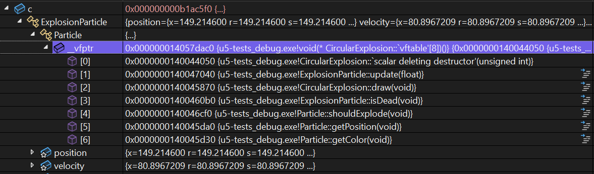
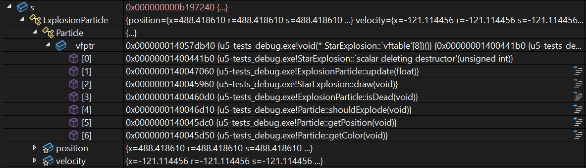

#### Análisis de un caso de estudio

🎯 **Enunciado**: en esta actividad vas a recordar y sobre todo a ``redescubrir`` 
algunos conceptos fundamentales de la programación orientada a objetos, pero 
esta vez lo harás desde la experimentación y la curiosidad. Quiero insistir 
en esto. En cursos previos ya abordaste teóricamente estos conceptos e 
incluso los aplicaste en ejercicios prácticos. Sin embargo, en esta actividad 
vas a experimentar con el caso de estudio y con el depurador de código para 
que puedas comprender mejor cómo se comportan los objetos en un programa y 
cómo se implementan algunos conceptos como la herencia, el polimorfismo y 
el encapsulamiento.

**Concepto de objeto**: en la programación orientada a objetos, un objeto 
es una instancia de una clase. Una clase define un tipo de objeto, pero no 
es un objeto en sí mismo. Pero ¿Cómo se ve un objeto en la memoria? 

Considera el caso de estudio. Usa el depurador para encontrar la instancia 
de la clase ofApp. Recuerda que debes usar el depurador porque ``el objeto 
solo estará en la memoria mientras la aplicación esté corriendo``.

Antes de comenzar el experimento observa la clase ofApp:


``` cpp
class ofApp : public ofBaseApp {
public:
    void setup();
    void update();
    void draw();
    void mousePressed(int x, int y, int button);
    void keyPressed(int key);

    std::vector<Particle*> particles;
    ~ofApp();

private:
    void createRisingParticle();

};
```

🧐🧪✍️ Antes de ejecutar el experimento, ¿Qué esperas ver 
en memoria (hipótesis)? Ejecuta el código y muestra una captura de 
pantalla del objeto en la memoria. ¿Qué puedes observar? ¿Qué 
información te proporciona el depurador? ¿Qué puedes concluir?

🧐🧪✍️ Usa de nuevo el depurador para capturar un objeto de tipo 
``CircularExplosion``. Es posible que tengas que hacer 
modificaciones mínimas en el código para que puedas capturar este 
objeto más fácilmente. Observa con el depurador la ventana de Auto o Locals 
y la ventana de Memory 1. Trata de buscar en memoria todas las partes 
que componen al objeto tipo ``CircularExplosion`` ¿Qué puedes observar 
en la memoria? ¿Qué información te proporciona el depurador? ¿Qué
puedes concluir? NO OLVIDES tener a la mano todas la jerarquía de clases 
que componen a ``CircularExplosion``. De esta manera podrás identificar 
cada parte del objeto en memoria.


**Concepto de los métodos virtuales**: observa de nuevo en memoria un objeto 
de tipo ``CircularExplosion``. Nota que el primer campo en memoria del objeto 
es un ``ExplosionParticle``. Abren el objeto ``ExplosionParticle`` y observa 
que el primer campo en memoria es un ``Particle``. Abre el objeto ``Particle``
y observa que el primer campo en memoria es ``_vtable``. ¿Qué es eso? Es un puntero 
a una tabla de funciones virtuales. Observa detenidamente la tabla de funciones. 

🧐🧪✍️ Captura la _vtable de un objeto ``CircularExplosion``, pega la imagen en tu 
bitácora, pero observa detenidamente la tabla de funciones. ¿Qué puedes observar?

Te voy a mostrar un ejemplo, en mi caso, de cómo se ve la tabla de funciones:



🧐🧪✍️ Ahora, captura en memoria la _vtable de un objeto ``StarExplosion``, 
pega la imagen en tu bitácora y observa detenidamente la tabla de funciones.

Te muestro de nuevo el ejemplo, en mi caso, de cómo se ve la tabla de funciones:




🧐🧪✍️ Observa de nuevo ambas tablas y compara. ¿Qué puedes ver? 
¿Qué puedes concluir? ¿Qué relación existe entre la tabla de funciones 
y los métodos virtuales? Esta pregunta que te voy a hacer no es fácil y la idea 
de hacerla es prepararte mentalmente para lo viene ¿Para qué crees que 
pueda servir una tabla de funciones virtuales? Para responder esta pregunta 
trata de pensar en el polimorfismo con interfaces y clases abstractas que viste 
al estudiar C#, por ejemplo, con interfaces:

``` csharp
using System;

interface IAnimal
{
    void HacerSonido();
}

class Perro : IAnimal
{
    public void HacerSonido()
    {
        Console.WriteLine("El perro ladra: ¡Guau, guau!");
    }
}

class Gato : IAnimal
{
    public void HacerSonido()
    {
        Console.WriteLine("El gato maúlla: ¡Miau, miau!");
    }
}

class Program
{
    static void Main()
    {
        // Polimorfismo: Usamos la interfaz para tratar diferentes tipos de animales
        IAnimal[] animales = new IAnimal[]
        {
            new Perro(),
            new Gato()
        };

        foreach (IAnimal animal in animales)
        {
            animal.HacerSonido(); // Llamada polimórfica
        }
    }
}
```

Nota que el método ``HacerSonido`` se llama dos veces, una vez para 
el perro y otra vez para el gato. ¿Cómo se logra esto? ¿Qué relación 
existe entre los métodos virtuales y el polimorfismo? Al llamar ``HacerSonido`` 
cómo sabe esta función sobre cuál objeto debe actuar?

Dejemos por ahora este experimento hasta este punto, pero un rato lo vamos retomar. 

**Concepto de encapsulamiento**: el encapsulamiento es un concepto fundamental 
en la programación orientada a objetos. En C++ el encapsulamiento se logra 
mediante el uso de modificadores de acceso. Te voy a proponer un experimento que 
puedes implementar creando un proyecto de consola de C++ en Visual Studio. 

``` cpp
class AccessControl {

private:
    int privateVar;

protected:
    int protectedVar;

public:
    int publicVar;
    AccessControl() : privateVar(1), protectedVar(2), publicVar(3) {}
};

int main() {
    AccessControl ac;
    ac.publicVar = 10; // Válido
    // ac.protectedVar = 20; // Error de compilación
    // ac.privateVar = 30; // Error de compilación
    return 0;
}
```

Ejecuta este código. Luego, descomenta las líneas que están comentadas y 
vuelve a compilar. ¿Qué sucede? ¿Por qué sucede esto? ¿Qué puedes concluir? 

Ahora quiero que notes algo. El encapsulamiento solo lo podemos garantizar en 
tiempo de compilación. Sin embargo, en tiempo de ejecución podemos acceder a 
los campos privados de un objeto. Analiza el siguiente programa:

``` cpp
#include <iostream>

class MyClass {
private:
    int secret1;
    float secret2;
    char secret3;

public:
    MyClass(int s1, float s2, char s3) : secret1(s1), secret2(s2), secret3(s3) {}

    void printMembers() const {
        std::cout << "secret1: " << secret1 << "\n";
        std::cout << "secret2: " << secret2 << "\n";
        std::cout << "secret3: " << secret3 << "\n";
    }
};


int main() {
    MyClass obj(42, 3.14f, 'A');
    // Esta línea causará un error de compilación
    std::cout << obj.secret1 << std::endl;

    obj.printMembers();  // Método público para mostrar los valores
    return 0;
}
```

🧐🧪✍️ Compila el programa. ¿Qué pasa?

Ahora prueba con este programa:

``` cpp	
#include <iostream>

class MyClass {
private:
    int secret1;
    float secret2;
    char secret3;

public:
    MyClass(int s1, float s2, char s3) : secret1(s1), secret2(s2), secret3(s3) {}

    void printMembers() const {
        std::cout << "secret1: " << secret1 << "\n";
        std::cout << "secret2: " << secret2 << "\n";
        std::cout << "secret3: " << secret3 << "\n";
    }
};

int main() {
    MyClass obj(42, 3.14f, 'A');

    // Usando reinterpret_cast para violar el encapsulamiento
    int* ptrInt = reinterpret_cast<int*>(&obj);
    float* ptrFloat = reinterpret_cast<float*>(ptrInt + 1);
    char* ptrChar = reinterpret_cast<char*>(ptrFloat + 1);

    // Accediendo y mostrando los valores privados
    std::cout << "Accediendo directamente a los miembros privados:\n";
    std::cout << "secret1: " << *ptrInt << "\n";       // Accede a secret1
    std::cout << "secret2: " << *ptrFloat << "\n";     // Accede a secret2
    std::cout << "secret3: " << *ptrChar << "\n";      // Accede a secret3

    return 0;
}
```

🧐🧪✍️ Compila el programa y ejecuta. ¿Qué puedes concluir?

🧐🧪✍️ En tus palabras, ¿Qué es el encapsulamiento? ¿Por qué es importante? 

**Concepto de herencia**: la herencia es otro concepto fundamental en la programación 
orientada a objetos. Observa de nuevo en ofApp.h la clase ``CircularExplosion``. Observa 
que esta clase hereda de la clase ``ExplosionParticle`` que a su vez hereda de la clase 
``Particle``. 

🧐🧪✍️ captura de nuevo la memoria que ocupa el objeto ``CircularExplosion`` compara 
la jerarquía de clases con los campos en memoria del objeto. ¿Qué puedes observar? 
¿Qué información te proporciona el depurador? ¿Qué puedes concluir?

🧐🧪✍️ ¿Cómo se implementa la herencia en C++?

🧐🧪✍️ C++ permite hacer algo que C# no: herencia múltiple. Realiza un experimento 
que te permita ver cómo se objeto en memoria cuya clase base tiene herencia múltiple.

**Concepto de polimorfismo**: recuerdas que ya analizaste el concepto de los métodos 
virtuales y su relación con la tabla de funciones virtuales. Ahora quiero que pienses 
en el polimorfismo. 

Observa en ofApp.cpp en el método ``update()`` esta parte del código:

``` cpp
    // Actualiza todas las partículas
    for (int i = 0; i < particles.size(); i++) {
        particles[i]->update(dt);
    }
```

el método update de la clase ``Particle`` es un método virtual. Usa el depurador 
para analizar cómo se comporta este método en tiempo de ejecución. Realiza 
esta verificación cuando particles tenga varios objetos de diferentes tipos 
de partículas. ¿Qué puedes observar? ¿Qué información te proporciona el depurador?

Nota que update se comporta de manera diferente para cada tipo de partícula. A esto 
se le llama polimorfismo en tiempo de ejecución.

🧐🧪✍️ Realiza un dibujo con el cuál expliques cómo se implementa el polimorfismo 
en tiempo de ejecución. Utiliza el concepto de métodos virtuales y la tabla de funciones 
virtuales. ¿Qué puedes concluir? 

🧐🧪✍️ ¿Qué relación existe entre los métodos virtuales y el polimorfismo?


📤 **Entrega**: reporta en la bitácora tu hallazgos en todos los puntos que te 
marqué para analizar 🧐, experimentar 🧪 y reportar ✍️.
