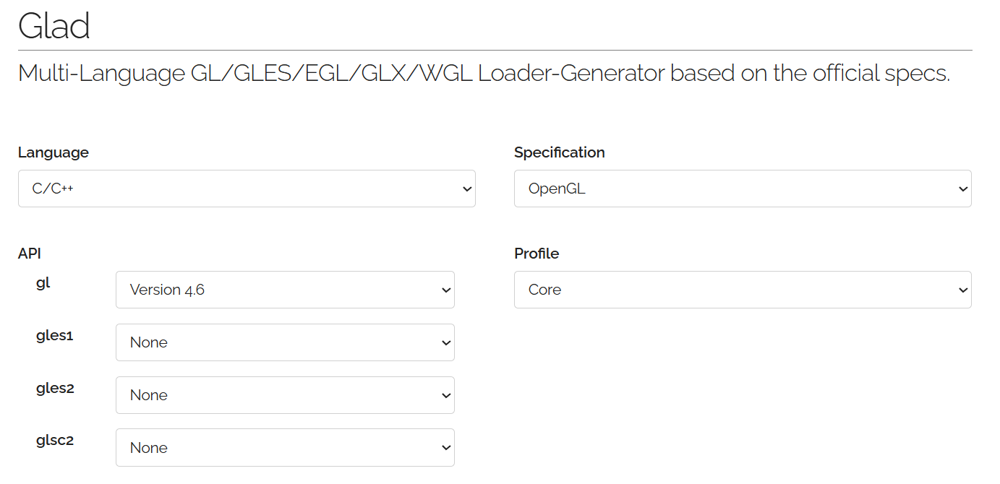
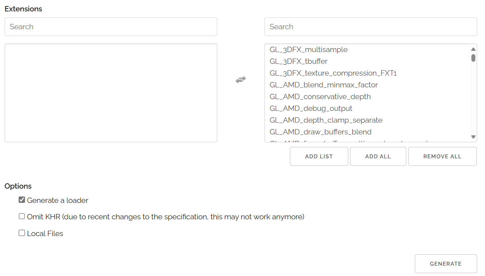
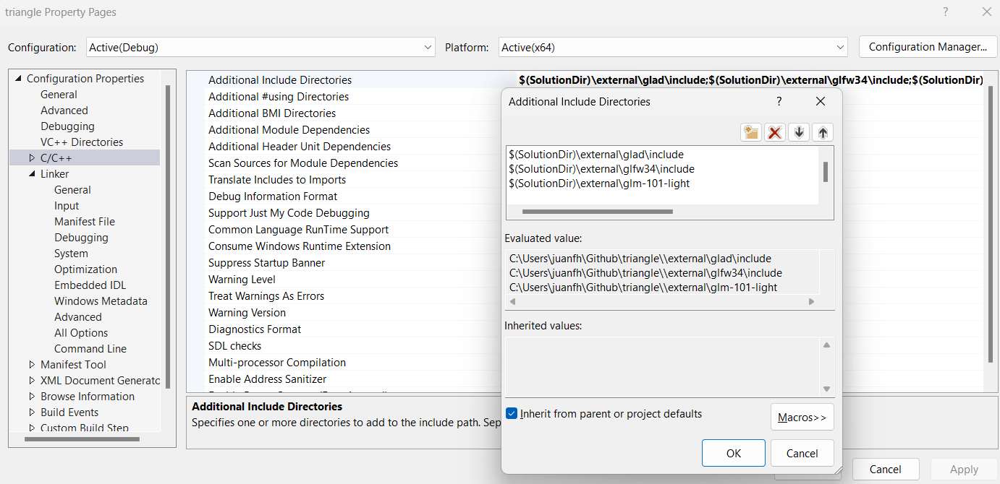
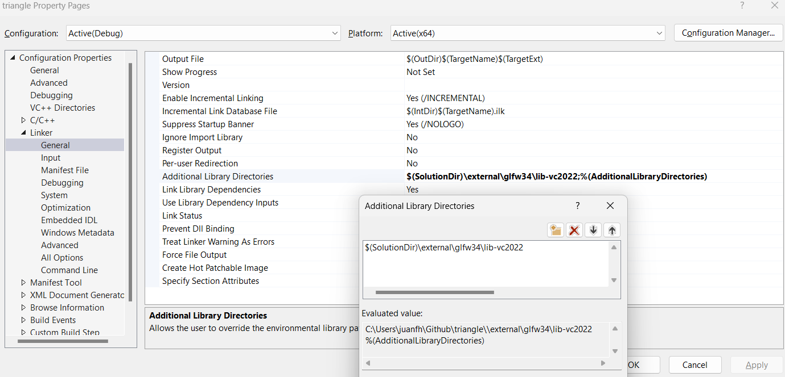
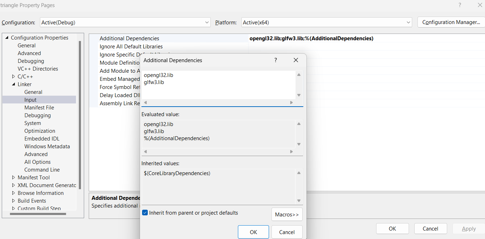

#### ¿Cómo se crea un proyecto OpenGL en Windows?

:::note[🎯 Enunciado]
En esta actividad vas a entender que necesitas para que un programa OpenGL funcione en Windows.
:::

**¿Cómo se crean un proyecto openGL en Windows?**

En la actividad anterior te entregué un ejemplo que vamos a analizar en esta fase de investigación. 
El ejemplo ya estaba previamente configurado y listo para compilar y ejecutar. Sin embargo, en esta actividad 
te voy a explicar cómo se crea un proyecto OpenGL desde cero porque hay algunos conceptos fundamentales 
del proceso de creación de un proyecto OpenGL que es importante que entiendas. Trata de reproducir el proceso 
en tu máquina. Si no lo logras, no te preocupes, en la fase de investigación vamos a profundizar en el tema.

Lo primero que necesitas es crear un proyecto vacío (Empty project) en C++ en Visual Studio. 
Luego, necesitas agregar las librerías de OpenGL, GLFW y GLAD. En el ejemplo del triángulo simple de la actividad 
anterior ya están incluidas las librerías y los archivos de encabezado necesarios. Además te incluí una biblioteca 
adicional llamada GLM, que es una biblioteca de matemáticas para gráficos 3D. De todas formas, esta biblioteca 
no es estrictamente necesaria para crear un proyecto OpenGL, pero es muy útil para trabajar con matrices y vectores.

Volvamos pues a la pregunta inicial: **¿Cómo se crean un proyecto OpenGL en Windows?** Una vez que tienes 
el proyecto vacío creado, lo vas a buscar en el explorador de archivos de Windows. Vas a crear una carpeta 
llamada **external** (observa en el ejemplo del triángulo simple esta carpeta y su contenido). Dentro de esa carpeta 
guardarás las dependencias de tu proyecto. Para hacer esto, crea estas carpetas, que son las que contienen 
las dependencias de tu proyecto:

```bash
glfw34
glad
glm-101-light
```

¿Qué dependencias necesitas y por qué? Comencemos con **GLFW**. Esta es una biblioteca que te permite crear ventanas y manejar eventos de entrada (teclado, ratón, etc.). [GLFW](https://www.glfw.org/) es una biblioteca multiplataforma, lo que significa que puedes usarla en Windows, Linux y MacOS. Para conseguir la biblioteca, lo que necesitas es ir al repositorio en Github y descargar el archivo glfw-3.4.bin.WIN64.zip que está en la sección de releases. Descomprime el archivo y guarda las siguientes carpetas 
en glfw34:

```bash
include
lib-vc2022
LICENSE.md
README.md
```

La carpeta include contiene los archivos de encabezado de la biblioteca. La carpeta lib-vc2022 contiene las bibliotecas compiladas para Visual Studio 2022.

Ahora sigamos con **GLAD**. Esta es una biblioteca que te permite cargar las funciones de OpenGL. [GLAD](https://glad.dav1d.de/) es un cargador de funciones de OpenGL que te permite acceder a las funciones de OpenGL en tiempo de ejecución. Para conseguir la biblioteca, lo que haces es ir al sitio web de GLAD y generar el código fuente para OpenGL 4.6 y el perfil Core. Luego descarga el archivo zip y guarda los directorios src e include en la carpeta glad que habíamos creado antes en external.

Te voy a mostrar unas capturas de pantalla para que veas cómo configurar las opciones en el sitio de GLAD:




Aquí tengo varias cosas interesantes para contarte. La primera es la versión de API de OpenGL. Nota que elegí la versión 4.6. 
Esto es porque es la versión más reciente de OpenGL y es la que vamos a usar en esta unidad. La segunda cosa interesante es el perfil. Elegí el perfil **Core** porque es el perfil más moderno de OpenGL. El perfil Compatibility es el perfil más antiguo de OpenGL y no lo vamos a usar en esta unidad.

Nos falta otra dependencia, ¿Verdad? Se trata de GLM. En este caso descargué el archivo glm-1.0.1-light.zip del repositorio de [GLM en Github](https://github.com/g-truc/glm/releases/tag/1.0.1). Nota que la versión descargada es la 1.0.1. Por eso en la carpeta 
externals se crea la carpeta glm-101-light. Allí guardas completa la carpeta glm que resulta de descomprimir el archivo zip.

Paremos aquí un momento. Yo se que estás pensando que esto es muy complicado, aburrido y que no tiene nada que ver con OpenGL, pero 
es importante que entiendas cómo funciona el proceso de creación de un proyecto OpenGL. Porque este mismo proceso lo podrás 
usar para crear otro tipo de proyectos con otras bibliotecas. Por ejemplo, si quieres crear un proyecto con [SDL](https://www.libsdl.org/) o [SFML](https://www.sfml-dev.org/), el proceso es el mismo.

¿Entonces ya terminamos? La verdad no. Hasta ahora solo hemos descargado las dependencias y las hemos organizado. Ahora 
falta configurar el proyecto en Visual Studio. Para hacer esto, lo que tienes que hacer es abrir el proyecto en Visual Studio y
agregar las rutas de las dependencias a las propiedades del proyecto. Para no aburrirte, te voy a mostrar las capturas de pantalla de cómo lo hice.

Para poder usar las bibliotecas, le digo a Visual Studio dónde están los archivos de cabecera:



Luego le indico a Visual Studio dónde están las bibliotecas .lib. En este caso solo hay una, que es la de GLFW. Las demás 
dependencias no tienen bibliotecas .lib porque son archivos de código fuente.



Ahora le digo a Visual Studio qué .lib específicas quiero usar. En este caso solo la de GLFW y una más (ya te digo cuál es).



Es posible que hayas notado una librería adicional llamada opengl32.lib. Esta biblioteca viene incluida con Windows y cumple un papel importante: permite crear el contexto inicial de OpenGL y acceder a las funciones básicas de la versión 1.1. Sin embargo, en nuestros ejemplos usaremos funciones más avanzadas (por ejemplo, de OpenGL 3.3 o 4.6), que no están en opengl32.lib, sino en los drivers de la tarjeta gráfica que tengas instalada. Esos drivers implementan las versiones modernas de OpenGL.

Como esas funciones no se pueden usar directamente, necesitamos una herramienta como GLAD, que se encarga de cargarlas dinámicamente en tiempo de ejecución. GLAD consulta al sistema operativo y a los drivers para obtener las direcciones de memoria de esas funciones, y así podemos usarlas como si fueran funciones normales en nuestro código.

¿Ya terminamos? Aún no, pero no te desanimes. Nos falta un paso importante: agregar el archivo de código fuente de GLAD al proyecto.

Esto se hace muy fácilmente: solo debes añadir (ojo, click derecho al proyecto en Visual Studio y seleccionas Add/New item) el archivo glad.c que se encuentra en la carpeta glad/src a tu proyecto. Este archivo contiene la implementación que permite cargar las funciones modernas de OpenGL en tiempo de ejecución.

¿Y ahora sí? ¡Ya casi! Solo falta un detalle final: debes asegurarte de que el archivo glfw3.dll esté en el directorio principal del proyecto. Este archivo lo puedes encontrar en la carpeta lib-vc2022 dentro del directorio glfw34 que descargaste previamente.

¿Por qué es necesario este archivo .dll? Porque glfw3.dll es una biblioteca dinámica que contiene el código que implementa las funciones de GLFW. Cuando ejecutas tu programa, el sistema necesita encontrar este archivo para poder acceder a esas funciones. Si el archivo no está presente, el programa compilará sin errores (porque usaste la versión .lib al enlazar), pero fallará al ejecutarse. 

¿Y entonces para qué sirve el archivo .lib? La biblioteca .lib es utilizada durante la compilación y el enlace. Le dice al compilador y al enlazador que existen ciertas funciones (como glfwInit() o glfwCreateWindow()), y que esas funciones estarán disponibles en tiempo de ejecución. Pero el código real está en el .dll, que se necesita cuando el programa se ejecuta.

En resumen:

.lib → usado en tiempo de compilación para enlazar el programa.

.dll → usado en tiempo de ejecución para que el programa funcione.

Por eso es crucial que copies glfw3.dll. Con eso, ahora sí... ¡Tenemos todo listo!

**🧩 ¿Qué necesitas para que un programa OpenGL funcione en Windows?**

Al desarrollar con OpenGL en Windows, intervienen varias bibliotecas y archivos que cumplen roles distintos. Aquí te explico **qué hace cada uno y por qué es necesario**:

---

🔹 `opengl32.lib` (de Windows)

- Es una **biblioteca de enlace estático** incluida con Windows.
- Permite crear el **contexto inicial de OpenGL** y usar funciones básicas de **OpenGL 1.1**.
- Es necesaria para iniciar cualquier programa OpenGL en Windows, aunque no contenga las funciones modernas.

:::note
📍 **Dónde están las funciones:** solo hasta OpenGL 1.1.  
🛠️ **Cuándo se usa:** durante la **compilación** para enlazar el inicio de OpenGL.
:::

---

🔹 GLFW

- Biblioteca multiplataforma para **crear ventanas**, manejar el **teclado**, el **mouse** y gestionar el contexto OpenGL.
- Requiere dos archivos:
  - `glfw3.lib`: le dice al compilador dónde están las funciones de GLFW.
  - `glfw3.dll`: contiene el **código real** que se usa en tiempo de ejecución.

:::note
📍 **Dónde están las funciones:** en el archivo `glfw3.dll`  
🛠️ **Cuándo se usa:**  
- `.lib`: en **compilación y enlace**.  
- `.dll`: en **ejecución**.  
⚠️ Si no colocas `glfw3.dll` en el directorio de tu ejecutable, el programa compila pero **no corre**.
:::

---

🔹 GLAD

- Es un **cargador de funciones de OpenGL**.
- Las funciones modernas de OpenGL (3.3, 4.6) **no están en `opengl32.lib`**: están implementadas por los **drivers de la GPU**.
- GLAD obtiene esas funciones desde el driver usando `wglGetProcAddress` y las hace disponibles en tu código.

:::note
📍 **Dónde están las funciones:** en los **drivers** de tu tarjeta gráfica.  
🛠️ **Cuándo se usa:** en **tiempo de ejecución**, cuando se llama a `gladLoadGL()`.  
📁 Necesitas agregar al proyecto el archivo `glad.c` y sus encabezados (`include/glad/glad.h`).
:::

---

🔹 GLM (opcional)

- Biblioteca de matemáticas para gráficos: vectores, matrices, transformaciones.
- Es solo código fuente (`.hpp`), no requiere `.lib` ni `.dll`.

:::note
📍 **Dónde están las funciones:** en los archivos `.hpp` de GLM.  
🛠️ **Cuándo se usa:** solo en **tiempo de compilación**  
📦 No es obligatoria para usar OpenGL, pero es muy útil.
:::

---

🧵 Conexión entre todos

1. **GLFW** crea la ventana y el contexto.
2. **opengl32.lib** permite iniciar OpenGL.
3. **GLAD** carga las funciones modernas del driver de tu GPU.
4. **GLM** te ayuda a hacer matemáticas para animaciones o transformaciones.

:::caution[📤 Entrega]
Necesito que hagas digestión de esta información y que la entiendas. Para ello te voy a pedir 
un resumen en tus propias palabras de lo que acabas de leer. En tu resumen debes tratar de 
conectar GLFW, opengl32.lib, GLAD, GLM y los drivers de la GPU. ¿Qué rol cumple cada uno? ¿Cómo se relacionan entre sí? 
Mira, trata de hacer esto de memoria y como si estuvieras contándole a un amigo que quiere aprender OpenGL. Cuando 
haces el proceso de memoria tu cerebro hace un esfuerzo adicional y eso te ayuda a aprender. Además, si no recuerdas 
algo quiere decir que no lo entendiste bien y eso es una buena señal para que vuelvas a leerlo.
:::

