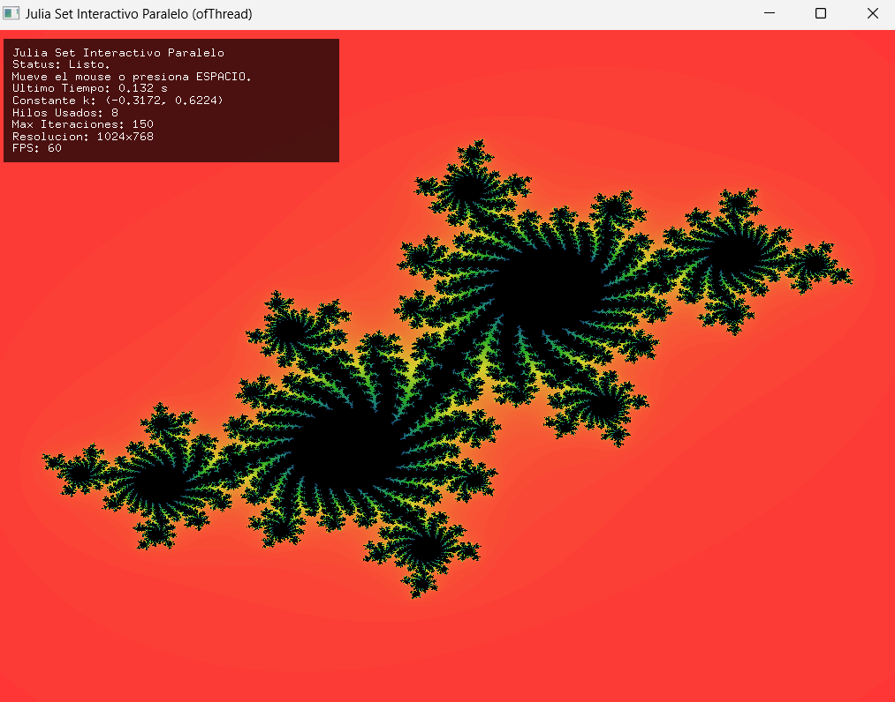

#### Aplicación: Julia set interactivo

:::note[🎯 Enunciado]
Es hora de aplicar lo aprendido sobre paralelismo. Tomarás el código funcional del fractal de Mandelbrot que estudiante (¿Cierto?) y lo modificarás para calcular y visualizar el **conjunto de Julia**. Harás que la constante `k` que define el fractal de Julia dependa de la posición del mouse, creando un explorador interactivo. El cálculo seguirá siendo paralelo.
:::



1. Crea un nuevo proyecto de openFrameworks y copia el código de Mandelbrot en su versión paralela.  
2. Modifica la lógica de cálculo:

*   Localiza la función que calcula el valor de un píxel (ej. `calculateMandelbrotPixel`). Necesitas cambiar su lógica para calcular Julia en lugar de Mandelbrot. ¿Cuál es la diferencia?
    *   **Mandelbrot:** `z = z^2 + c` (donde `c` es la coordenada del píxel, `z` empieza en 0).
    *   **Julia:** `z = z^2 + k` (donde `k` es una constante fija para toda la imagen, `z` empieza en la coordenada del píxel).
*   Necesitarás:
    *   Una variable (probablemente global o en `ofApp` si refactorizas) para almacenar la constante compleja `k` actual (ej. `glm::vec2 juliaK;`).
    *   Modificar la función de cálculo para que:
        *   Reciba `k` como parámetro (o la acceda globalmente).
        *   Inicialice `z` con las coordenadas complejas correspondientes al píxel `(x, y)`.
        *   Itere usando `z = z * z + k;` (la multiplicación `z*z` requiere manejar números complejos o sus componentes).
        *   El resto (comprobación de escape, conteo de iteraciones) es similar a Mandelbrot.

3. Integra la interacción del mouse:

*   Necesitas actualizar la constante `juliaK` basándose en la posición del mouse.
*   En la función `update()` o en un callback de movimiento del mouse (`mouseMoved`), mapea `mouseX` y `mouseY` a un rango adecuado para las partes real e imaginaria de `k`. Un rango común es de -1.5 a 1.5 para ambos.

    ```cpp
    // Ejemplo de mapeo dentro de update() o mouseMoved()
    // Asumiendo que tienes windowWidth y windowHeight
    juliaK.x = ofMap(mouseX, 0, windowWidth, -1.5f, 1.5f);
    juliaK.y = ofMap(mouseY, 0, windowHeight, -1.5f, 1.5f);
    // Necesitarás una bandera o mecanismo para indicar que hay que recalcular
    // si k ha cambiado.
    ```

*   **Importante:** cada vez que `juliaK` cambie, necesitarás disparar un recálculo *completo* de la imagen usando los hilos. La estructura de hilos que divide el trabajo por filas puede reutilizarse tal cual, solo necesitas asegurarte de que la función que llaman ahora calcula Julia con la `k` actualizada.

4. Reutilizar la estructura de hilos: la lógica para crear, lanzar, y esperar a los hilos que tenías en el Mandelbrot paralelo debería poder reutilizarse casi directamente. Cada hilo seguirá calculando un conjunto de filas, pero ahora llamará a tu nueva función `calculateJuliaPixel` (o como la llames) pasándole la `k` actual.

:::note[🧐🧪✍️]
1.  Pega la parte clave de tu función modificada que calcula el píxel para el conjunto de Julia. Recuerda utilizar un bloque cpp:

```cpp
    ```cpp
    // Aquí va tu código
    ```
```
2.  Muestra cómo mapeaste la posición del mouse a la constante `k`.
3.  Describe brevemente cómo reutilizaste la estructura de hilos de la versión Mandelbrot. ¿Tuviste que cambiar mucho esa parte?
4.  ¿Cómo te aseguraste de que la imagen se recalculara cuando el mouse se movía?
5.  Incluye al menos dos capturas de pantalla que muestren diferentes fractales de Julia generados al mover el mouse en tu aplicación.
6.  ¿Encontraste algún desafío particular al implementar la interacción o modificar el cálculo?
:::


:::caution[📤 Entrega]
El código fuente completo de tu Julia paralelo y las respuestas a las preguntas y las capturas de pantalla en tu bitácora
:::